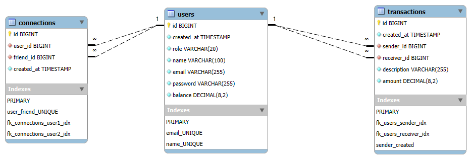

# Pay My Buddy

## Description
**Pay My Buddy** est une application qui permet à ses utilisateurs d'effectuer des **transferts d'argent** entre amis de manière **simple et sécurisée**.

## Présentation de la base de données
L'application utilise **MySQL**.
Avant de lancer l’application, vous devez créer la base de données et importer les scripts SQL.
Les détails du modèle de données se trouvent dans la section "Base de Données".

## Installation

### Prérequis
Avant d'installer l'application, assurez-vous d'avoir installé :
- Java 23
- Maven 3.9
- MySQL 8.x

### Étapes d'installation
1. **Cloner le repository** :
   ```sh
   git clone https://github.com/zoolookikki/paymybuddy.git
   ```
2. **Générer le JAR** :
   ```sh
   mvn clean package
   ```
3. **Configurer la base de données** :
   Avant de lancer l'application, la base de données MySQL **doit être initialisée** avec les bonnes structures et les données de test.
   pay_my_buddy.sql est le script de création des tables.
   load_data.sql est le script permettant de charger des données de test.
   Exécuter les scripts SQL situés dans le répertoire sql :
   ```sh
   mysql -u root -p < sql/pay_my_buddy.sql
   ```
   ```sh
   mysql -u root -p pay_my_buddy < sql/load_data.sql
   ```
4. **Paramétrer la connexion à la base de données** :
   L'application utilise des **variables d'environnement** pour sécuriser la connexion à la base de données et éviter d’exposer directement les identifiants dans le code source. 
   Avant de lancer l'application, assurez-vous de définir les variables suivantes :
   ```sh
   PAYMYBUDDY_SPRING_DATASOURCE_URL "jdbc:mysql://localhost:3306/pay_my_buddy?serverTimezone=UTC"
   PAYMYBUDDY_SPRING_DATASOURCE_USERNAME "votre nom d'utilisateur"
   PAYMYBUDDY_SPRING_DATASOURCE_PASSWORD "votre_mot_de_passe"
   ```
5. **Lancer l'application** :
   ```sh
   mvn spring-boot:run 
   ```
   ou 
   ```sh
   java -jar target\paymybuddy-0.0.1-SNAPSHOT.jar
   ```
6. **Accéder à l'application** :
   Si vous utilisez les données de test, le mot de passe par défaut de chaque utilisateur est son nom.
   ```sh
   http://localhost:8080
   ```

## Base de Données

L'application utilise MySQL pour stocker les utilisateurs, les transactions et les relations entre utilisateurs.
**Spring Boot** gère la connexion grâce à **Spring Data JPA** et **MySQL Connector**.

### Modèle Physique de Données (MPD)



### Tables principales :
- `users` : Stocke les informations des utilisateurs
- `transactions` : Historique des transactions entre utilisateurs
- `connections` : Liste des relations entre amis

## Technologies et dépendances utilisées
- Java 23
- Spring Boot 3
  - Spring Security
  - Spring Data JPA
  - Spring Web
  - Thymeleaf
  - Lombok
- Maven 3.9
- MySQL 8
- Hibernate

## Sécurité
- **Spring Security** est utilisé pour protéger les accès utilisateurs et administrateurs.
- CSRF Protection activée par défaut (désactivée pour l'API de test).
- **Authentification et autorisation** basées sur les rôles (`USER` et `ADMIN`).

<!-- 
## Licence
Ce projet est sous licence ...
-->

<!--
## Auteur
- **Votre Nom** - [GitHub](https://github.com/votre-utilisateur)
-->
